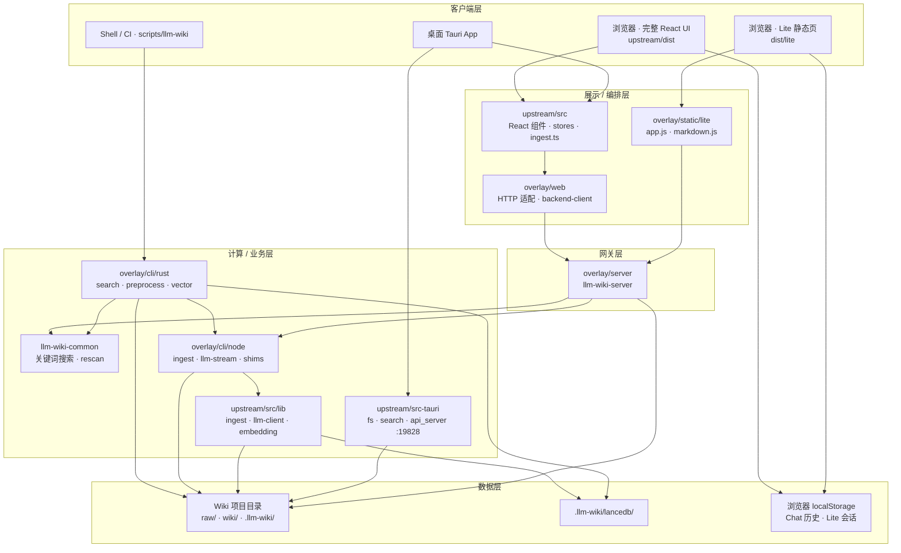
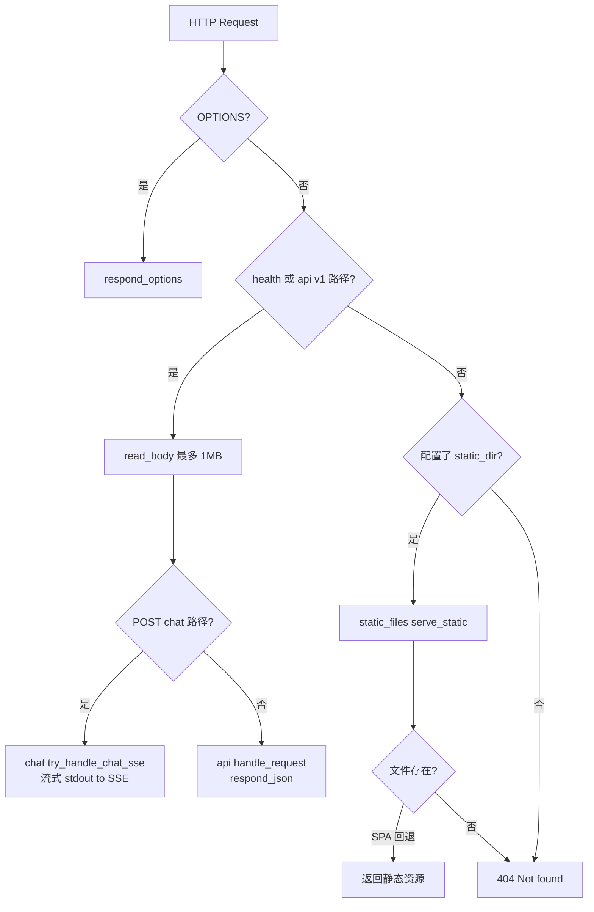
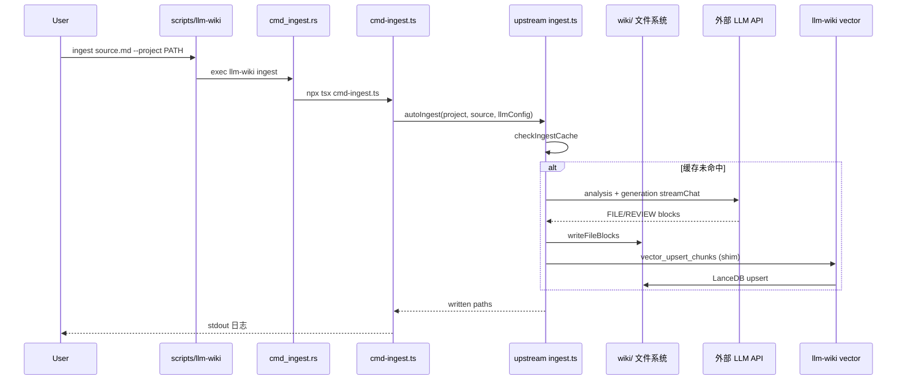
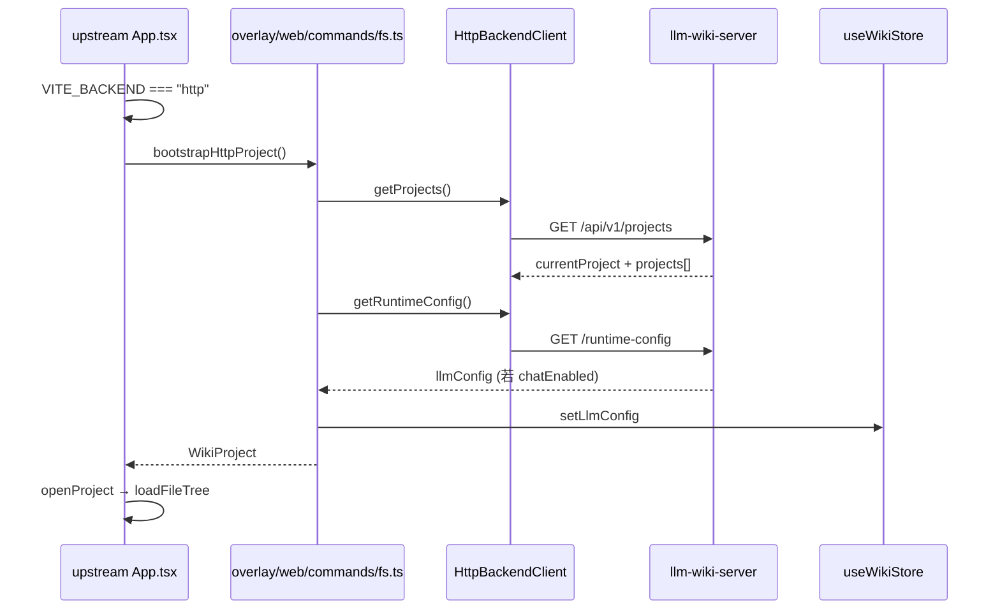
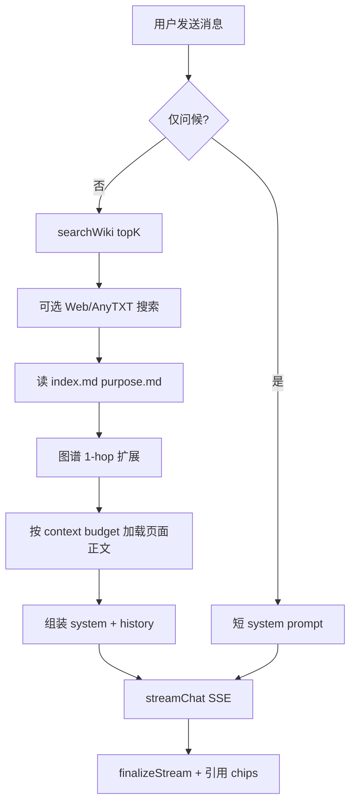
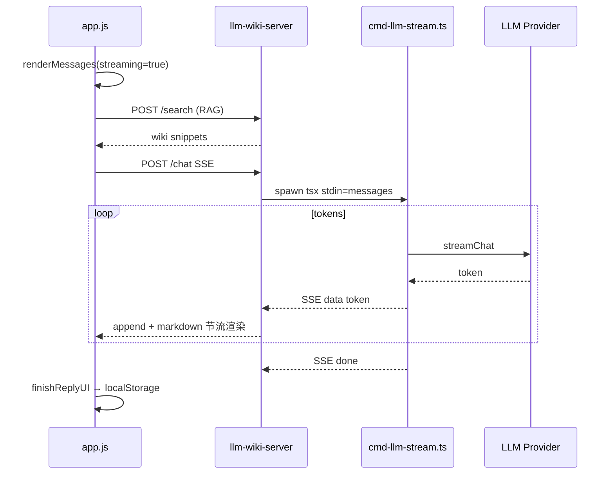
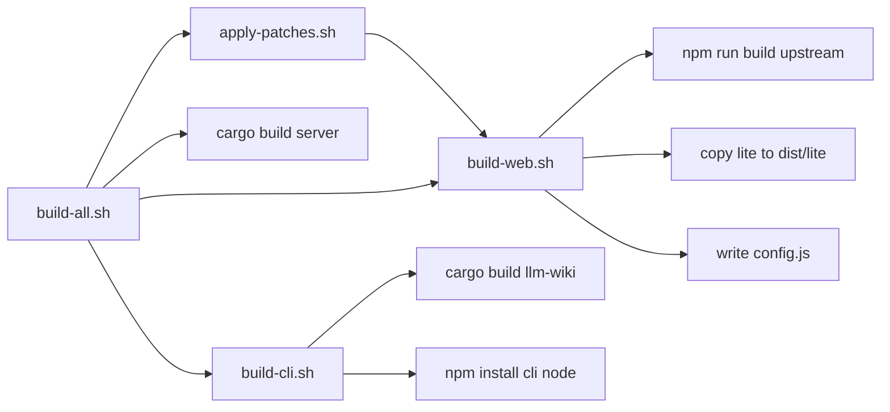
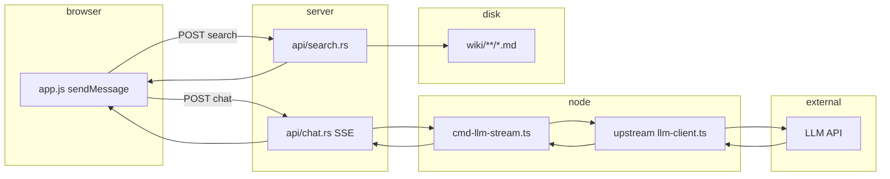
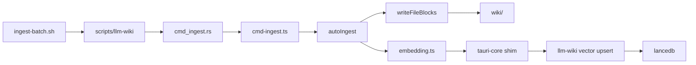
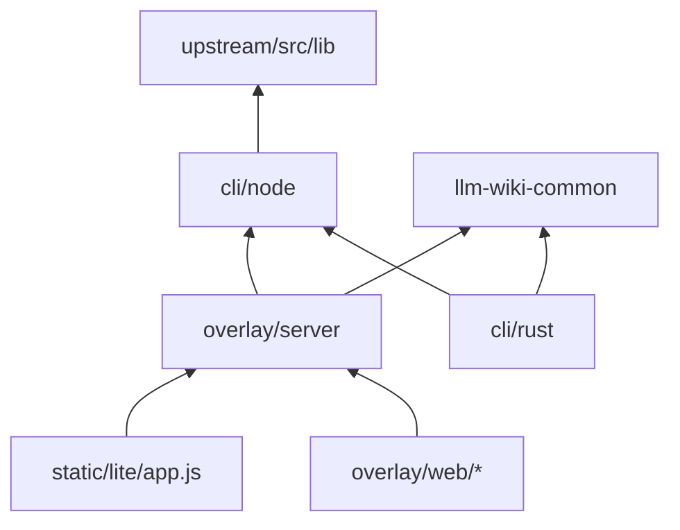

# 代码逻辑与模块关系总览

> 最后更新：2026-06-07  
> 适用仓库：`llm_wiki-server`（集成 overlay + upstream submodule **v0.4.20**）  
> 全局文档入口：[文档指引.md](../文档指引.md)  
> 姊妹文档：[架构与改造方案.md](./架构与改造方案.md)（改造方案）、[上游架构说明.md](./上游架构说明.md)（上游桌面版）

本文档按**分层架构 → 目录与文件职责 → 关键调用链**组织，帮助理解各模块如何协作。Wiki 项目数据（`~/overseas-github/llm_wiki_projects/*`）不在本仓库 Git 内。

---

## 目录

1. [仓库总览](#1-仓库总览)
2. [分层架构](#2-分层架构)
3. [运行模式对比](#3-运行模式对比)
4. [集成仓库根目录](#4-集成仓库根目录)
5. [overlay/server — HTTP 服务](#5-overlayserver--http-服务)
6. [overlay/crates/llm-wiki-common — 共享 Rust 库](#6-overlaycratesllm-wiki-common--共享-rust-库)
7. [overlay/cli — 命令行](#7-overlaycli--命令行)
   - [7.4 Ingest 实现说明](#74-ingest-实现说明)
8. [overlay/web — HTTP 版 React 适配层](#8-overlayweb--http-版-react-适配层)
9. [overlay/static/lite — 轻量静态问答页](#9-overlaystaticlite--轻量静态问答页)
10. [upstream — 上游桌面应用（submodule）](#10-upstream--上游桌面应用submodule)
11. [配置与 Wiki 项目目录](#11-配置与-wiki-项目目录)
12. [构建与脚本流水线](#12-构建与脚本流水线)
    - [12.1 upstream/dist 构建产物](#121-upstreamdist-构建产物)
    - [12.2 Docker 容器化部署](#122-docker-容器化部署)
13. [关键调用链（Mermaid）](#13-关键调用链mermaid)
14. [HTTP API 一览](#14-http-api-一览)
15. [扩展阅读](#15-扩展阅读)

---

## 1. 仓库总览

```text
llm_wiki-server/                    # 集成仓库（你当前工作的仓库）
├── upstream/                       # git submodule → nashsu/llm_wiki（官方桌面版，不在此改业务逻辑）
│   ├── src/                        # React 19 前端
│   ├── src-tauri/                  # Tauri v2 Rust 后端
│   └── dist/                       # Vite 构建产物（HTTP UI + lite/）
├── overlay/                        # 100% 定制代码
│   ├── server/                     # Headless HTTP 服务（Rust）
│   ├── cli/                        # CLI：Rust 入口 + Node/TS 包装 upstream ingest
│   ├── web/                        # HTTP 模式下替换 upstream 若干模块
│   ├── static/lite/                # 轻量静态问答 UI 源码
│   ├── crates/llm-wiki-common/     # server 与 CLI 共用的 Rust crate
│   ├── config/                     # server / CLI 配置样例
│   └── patches/                    # 对 upstream 的最小 patch（HTTP bootstrap）
├── scripts/                        # 构建、E2E、llm-wiki 统一入口
├── docs/                           # 文档
└── docker/                         # 容器化
```

**设计原则：**

| 规则 | 含义 |
|------|------|
| upstream 零定制 commit | 定制通过 `overlay/` + patch 叠加 |
| 按 tag 升级 upstream | 当前 pin **v0.4.20** |
| 写入走 CLI | HTTP UI / Lite **只读** wiki 文件；入库用 `llm-wiki ingest` |
| Chat 走服务端代理 | 浏览器不直连 LLM API（绕 CORS、密钥在 server 配置） |

---

## 2. 分层架构



**依赖方向（简记）：**

- 浏览器 → **server API** → 读 wiki / 搜索 / Chat SSE
- **CLI** → 写 wiki / 向量索引 / 预处理（不经过 HTTP server）
- **upstream TS** 被 CLI Node 层通过 **path alias + shims** 复用，而非复制代码

---

## 3. 运行模式对比

| 维度 | 桌面 Tauri | HTTP 完整 UI (`/`) | Lite 静态页 (`/lite/`) |
|------|------------|-------------------|------------------------|
| 入口 | `npm run tauri dev` | `llm-wiki-server` + `upstream/dist` | 同上，访问 `/lite/` |
| 项目加载 | 用户选文件夹 / 上次打开 | `bootstrapHttpProject()` 读 server 当前项目 | 用户选卡片（多 `projects[]`） |
| 读 wiki | Tauri `invoke(read_file)` | `GET /files/content` | 不浏览文件树 |
| 搜索 | Rust hybrid（关键词+向量） | `POST /search`（当前仅关键词） | `POST /search`（RAG） |
| Chat | 浏览器直连 LLM（tauri-http） | `POST /chat` SSE 经 server 代理 | 同左 |
| 写入 / Ingest | GUI + `ingest.ts` | ❌ 只读 | ❌ |
| 配置 | Settings UI + Tauri store | `LLM_WIKI_CONFIG` JSON | 同左 |
| Chat 历史 | `.llm-wiki/chats/` 或 store | `localStorage` | `localStorage`（按 projectId） |

---

## 4. 集成仓库根目录

| 路径 | 职责 |
|------|------|
| `README.md` | 仓库简介、快速启动 |
| `README-OVERLAY.md` | Overlay 开发工作流 |
| `scripts/llm-wiki` | 统一 CLI 入口：`exec overlay/cli/rust/target/release/llm-wiki`，设置 `LLM_WIKI_REPO` |
| `scripts/build-all.sh` | patch → build-web → cargo server → build-cli |
| `scripts/build-web.sh` | `VITE_BACKEND=http` 构建 React UI，复制 `overlay/static/lite` → `dist/lite` |
| `scripts/build-cli.sh` | 编译 Rust CLI + `npm install` in `overlay/cli/node` |
| `scripts/apply-patches.sh` | 对 clean upstream 应用 `overlay/patches/*.patch` |
| `scripts/sync-upstream.sh` | 升级 submodule 到指定 tag |
| `scripts/ingest-batch.sh` | 批量 ingest `raw/sources/*.md`（已入库 SKIP，失败 exit 1） |
| `scripts/e2e-*.sh` | 本地 / Docker / 全链路测试 |
| `docker/` | 容器化部署，见 [docker/README.md](../docker/README.md) |

---

## 5. overlay/server — HTTP 服务

### 5.1 源码树

```text
overlay/server/src/
├── main.rs              # CLI 参数、Ctrl+C、调用 server::run
├── config.rs            # ServerConfig::resolve，静态目录探测
├── server.rs            # tiny_http 主循环、dispatch_request
├── state.rs             # ServerState（替代 Tauri AppHandle）
├── static_files.rs      # SPA 静态文件、MIME、read_body_limited
└── api/
    ├── mod.rs           # 路由表、鉴权、限流、CORS、resolve_project
    ├── projects.rs      # GET /projects，load_projects（多项目）
    ├── files.rs         # GET /files、/files/content（路径安全）
    ├── search.rs        # POST /search → llm_wiki_common::search_keyword
    ├── graph.rs         # GET /graph，解析 wikilink 建图
    ├── runtime.rs       # GET /runtime-config（chatEnabled、llmConfig 摘要）
    └── chat.rs          # POST /chat SSE（spawn cmd-llm-stream.ts）
```

### 5.2 核心类型

**`ServerConfig`**（`config.rs`）

| 字段 | 来源 | 说明 |
|------|------|------|
| `project` | `--project` / `LLM_WIKI_PROJECT` | 当前默认 wiki 项目根 |
| `bind` | `--bind` / `LLM_WIKI_BIND` | 默认 `127.0.0.1:8080` |
| `config_path` | `--config` / `LLM_WIKI_CONFIG` | 含 `llmConfig`、`projects[]` 的 JSON |
| `static_dir` | `--static-dir` / `LLM_WIKI_STATIC` | 通常 `upstream/dist` |
| `token_override` | `--token` / `LLM_WIKI_API_TOKEN` | API 鉴权 |

**`ServerState`**（`state.rs`）

- 持有 canonical `project` 路径、config 路径、token
- `load_app_state()`：解析 JSON 配置（5s 缓存），供 runtime / chat 使用
- `api_enabled()` / `api_token()` / `api_allow_unauthenticated()`

### 5.3 请求分发逻辑



**Chat 为何单独分支：** JSON 路由无法流式转发子进程 stdout；`handle_request` 内对 `POST .../chat` 故意返回 **501**，强制走 `server.rs` 的 SSE 分支。

**静态文件规则**（`static_files.rs`）：

- `/` → `index.html`
- `/lite/` → `lite/index.html`（子目录 index）
- 无扩展名路径（如 `/settings`）→ SPA 回退 `index.html`
- `.js` / `.mjs` → `application/javascript`

### 5.4 Chat SSE 细节（`api/chat.rs`）

1. 鉴权、`resolve_project(project_id)`
2. 要求 `LLM_WIKI_CONFIG` 含 `llmConfig`
3. 校验 body：`{ "messages": [ { "role", "content" }, ... ] }`
4. `Command::new("npx").args(["tsx", cmd-llm-stream.ts, "--config", ...])`
5. stdin 写入完整 JSON body；stdout .pipe 到 HTTP `text/event-stream`
6. 后台 thread `child.wait()` 回收进程

---

## 6. overlay/crates/llm-wiki-common — 共享 Rust 库

```text
overlay/crates/llm-wiki-common/
├── Cargo.toml
└── src/
    ├── lib.rs
    ├── project.rs       # normalize_path, resolve_project_dir, wiki_dir, sources_dir
    ├── rescan.rs        # rescan_project：遍历 raw/sources 算 md5
    └── search/
        ├── mod.rs
        └── keyword.rs   # search_keyword：wiki/**/*.md 分词打分
```

| 模块 | 导出 | 使用者 |
|------|------|--------|
| `project` | 路径规范化、项目 ID | CLI 各 cmd_* |
| `rescan` | `RescanReport` | CLI `cmd_rescan`（server 的 rescan HTTP 仍 501） |
| `search` | `search_keyword`, `ProjectSearchResponse` | **server** `api/search.rs`、**CLI** `cmd_search.rs` |

**搜索算法概要：** 对 query 分词，在 `wiki/` 下 `.md` 文件标题与正文匹配，加权得分，返回 snippet（UTF-8 安全截断）。

---

## 7. overlay/cli — 命令行

### 7.1 结构

```text
overlay/cli/
├── rust/                         # 二进制 llm-wiki（clap）
│   └── src/
│       ├── main.rs               # 子命令 dispatch
│       ├── config.rs             # load_config, ${ENV} 展开
│       ├── cmd_search.rs
│       ├── cmd_preprocess.rs
│       ├── cmd_rescan.rs
│       ├── cmd_reindex.rs
│       ├── cmd_ingest.rs         # spawn Node cmd-ingest.ts
│       ├── cmd_vector.rs         # 隐藏：LanceDB upsert/delete/count
│       └── vector.rs
└── node/
    └── src/
        ├── cmd-ingest.ts         # → upstream autoIngest()
        ├── cmd-reindex.ts        # → upstream embedAllPages()
        ├── cmd-llm-stream.ts     # → upstream streamChat()，写 SSE
        ├── load-config.ts
        ├── setup-stores.ts       # 注入 Zustand llmConfig
        └── shims/                # 替换 Tauri / @/commands/fs
            ├── fs.ts
            ├── tauri-core.ts     # invoke → llm-wiki vector *
            └── ...
```

### 7.2 命令 → 实现映射

| 用户命令 | 实现层 | 关键函数 / 文件 |
|----------|--------|-----------------|
| `llm-wiki search` | Rust + common | `cmd_search::run` → `search_keyword` |
| `llm-wiki preprocess` | Rust | 文本复制或简单提取（无 pdfium） |
| `llm-wiki rescan` | Rust + common | `rescan_project` |
| `llm-wiki reindex` | Rust；`--vectors` → Node | `cmd_reindex` → `cmd-reindex.ts` |
| `llm-wiki ingest` | Rust spawn Node | `cmd_ingest::run` → `cmd-ingest.ts` → `autoIngest` |
| `llm-wiki vector *` | Rust LanceDB | 由 upstream embedding 经 shim `invoke` 调用 |
| HTTP `POST /chat` | Server spawn Node | `cmd-llm-stream.ts` → `streamChat` |

### 7.3 Node 如何运行 upstream TypeScript

`overlay/cli/node/tsconfig.json` 将：

- `@/*` → `../../../upstream/src/*`
- `@tauri-apps/api/core` → `shims/tauri-core.ts`
- `@/commands/fs` → `shims/fs.ts`（Node fs 读写 wiki 目录）

因此 **ingest / embedding / streamChat** 复用 upstream 同一份 TS，无需 fork。

### 7.4 Ingest 实现说明

**结论：** Ingest 的核心逻辑在 **`upstream/src/lib/ingest.ts`**（约 2600 行）。Rust CLI **不**做 LLM 编译，只校验路径并 `spawn` Node；bash 批量脚本只做循环调度。日常操作见 [日常运维 §3](./日常运维.md#3-ingest编译-wiki)；本节供改代码或排查 ingest 行为时使用。

#### 7.4.1 为何不是 Rust / 纯 bash

| 层 | 角色 | 原因 |
|----|------|------|
| **bash** | `scripts/llm-wiki`、`ingest-batch.sh` | 设 env、循环、日志 |
| **Rust** | `cmd_ingest.rs` | 路径校验、spawn Node、LanceDB `vector *` |
| **Node + upstream TS** | `autoIngest` | upstream ingest 绑 Zustand/Tauri，~2500 行，CLI 用 shim 复用而非重写 |

#### 7.4.2 完整调用链

```text
./scripts/llm-wiki ingest FILE --project PATH --config CONFIG
  scripts/llm-wiki（bash）          → LLM_WIKI_REPO，exec Rust 二进制
  overlay/cli/rust/cmd_ingest.rs    → 校验 project/source/config，canonicalize config 路径
                                    → npx tsx overlay/cli/node/src/cmd-ingest.ts
                                      cwd = overlay/cli/node
  overlay/cli/node/cmd-ingest.ts    → loadConfigFile + hydrateStoresFromConfig
                                    → autoIngest(project, source, llmConfig)
  upstream/src/lib/ingest.ts        → autoIngestImpl（读 raw、LLM、写 wiki、可选 embedding）

scripts/ingest-batch.sh             → 遍历 raw/sources/*.md，逐篇调用上面命令；wiki/sources 已存在则 SKIP
```



#### 7.4.3 代码归属

| 职责 | 文件 |
|------|------|
| bash 入口 | `scripts/llm-wiki` |
| bash 批量 | `scripts/ingest-batch.sh` |
| Rust 调度 | `overlay/cli/rust/src/cmd_ingest.rs` |
| Node 入口 | `overlay/cli/node/src/cmd-ingest.ts` |
| 配置 → Zustand | `load-config.ts`、`setup-stores.ts` |
| FS / Tauri shim | `overlay/cli/node/src/shims/fs.ts`、`tauri-core.ts` 等 |
| **Ingest 核心** | **`upstream/src/lib/ingest.ts`** — `autoIngest` / `autoIngestImpl` |
| LLM HTTP | `upstream/src/lib/llm-client.ts` — `streamChat` |
| Embedding | `upstream/src/lib/embedding.ts` — `embedPage` |
| LanceDB 写入 | `overlay/cli/rust/src/cmd_vector.rs`（经 shim `invoke`） |

#### 7.4.4 CLI shim（headless 如何跑桌面 TS）

`overlay/cli/node/tsconfig.json` 将 upstream 的 Tauri/FS import 指到 shim：

| upstream 引用 | CLI 实现 |
|---------------|----------|
| `@/commands/fs` | `shims/fs.ts` — Node `fs/promises` 读写 wiki |
| `@tauri-apps/api/core` | `shims/tauri-core.ts` — `spawn llm-wiki vector upsert-chunks` 等 |
| `@/lib/tauri-fetch` | `shims/tauri-fetch.ts` — `globalThis.fetch` 调 LLM |
| `@/lib/ingest`、`@/lib/llm-client` | 仍为 upstream 源码 |

`hydrateStoresFromConfig` 把 JSON 里的 `llmConfig` / `embeddingConfig` 注入 `useWikiStore`，与桌面 Settings 等价。

#### 7.4.5 `autoIngestImpl` 流水线

入口：`autoIngest` → 项目级锁 `withProjectLock` → `autoIngestImpl`（`upstream/src/lib/ingest.ts`）。

| 阶段 | 做什么 | 关键符号 |
|------|--------|----------|
| 读上下文 | 源文 + `purpose.md` + `schema.md` + `wiki/index.md` + `wiki/overview.md` | `tryReadSourceTextFile` |
| 缓存 | 源内容未变则跳过 LLM（可能仍补图片/caption） | `checkIngestCache` |
| 0.5–0.6 图片 | 抽图到 `wiki/media/`，可选 VLM caption | `extractAndSaveSourceImages` |
| 长文 | 超 context 预算则分块分析再合并 | `analyzeLongSourceInChunks` |
| **Step 1 分析** | LLM 读源文 → 结构化分析 | `streamChat` + `buildAnalysisPrompt` |
| **Step 2 生成** | LLM 根据分析 → 输出 FILE 块 | `streamChat` + `buildGenerationPrompt` |
| Step 2.5 | 大文档可选 review 阶段 | `shouldRunDedicatedReviewStage` |
| **Step 3 写盘** | 解析 `---FILE: wiki/...---` 块，sanitize，merge，写 wiki | `writeFileBlocks` |
| Step 3.5 | 图片引用追加到 source-summary 页 | `injectImagesIntoSourceSummary` |
| Step 4–5 | review items、ingest 缓存 | `saveIngestCache` |
| **Step 6** | `embeddingConfig.enabled` 时对新页 embed | `embedPage` → shim → `llm-wiki vector` → `.llm-wiki/lancedb/` |

LLM 输出格式（Step 2）示例：

```text
---FILE: wiki/sources/某主题.md---
（YAML frontmatter + Markdown）
---END FILE---
---FILE: wiki/concepts/某概念.md---
...
```

#### 7.4.6 CLI 与桌面版两条路径

| 路径 | 入口 | 用途 |
|------|------|------|
| **Headless（CLI / batch）** | `autoIngest` | 全自动：分析 → 生成 → 写盘，无 Chat UI |
| **桌面交互** | `startIngest` → 用户对话 → `executeIngestWrites` | GUI 里先看分析、再确认写入；**共用** `writeFileBlocks` |

HTTP 服务**不支持** ingest；入库仅在本地 CLI 或桌面版完成。

---

## 8. overlay/web — HTTP 版 React 适配层

HTTP 构建时，Vite **优先**把下列 import 指到 overlay（`upstream/vite.config.ts`，须在 `@` 别名之前）：

| upstream import | overlay 替换文件 | 作用 |
|-----------------|------------------|------|
| `@/commands/fs` | `overlay/web/commands/fs.ts` | 读 API；`bootstrapHttpProject` |
| `@/commands/file-sync` | `overlay/web/commands/file-sync.ts` | 空操作 stub |
| `@/lib/search` | `overlay/web/lib/search.ts` | `searchWiki` → POST /search |
| `@/lib/llm-client` | `overlay/web/lib/llm-client.ts` | `streamChat` → POST /chat SSE |
| `@/lib/persist` | `overlay/web/lib/persist.ts` | Chat → localStorage |
| `@/lib/project-store` | `overlay/web/lib/project-store.ts` | 设置 → localStorage |

### 8.1 `backend-client.ts`

**类 `HttpBackendClient`**（单例 `getBackendClient()`）：

| 方法 | HTTP | 说明 |
|------|------|------|
| `health()` | GET `/health` | |
| `getProjects()` | GET `/projects` | 含 `currentProject` |
| `listFiles` / `readFileContent` | GET `/files` | 只读 wiki 树 |
| `getRuntimeConfig()` | GET `/runtime-config` | `chatEnabled`, `llmConfig` |
| `search()` | POST `/search` | RAG 检索 |
| `chatStream()` | POST `/chat` | 返回原始 Response（SSE） |

鉴权：`Authorization: Bearer` + 可选 `?token=`。

### 8.2 HTTP 项目启动（`bootstrapHttpProject`）



若 alias 顺序错误导致加载了 upstream 桌面版 `fs.ts`，`bootstrapHttpProject()` 恒返回 `null` → 欢迎页卡住（见 DEVELOPMENT §Q7）。

### 8.3 完整 UI Chat 流程（`chat-panel.tsx`）

上游组件 **`ChatPanel`** 在 HTTP 模式下通过 alias 自动使用 overlay 的 `searchWiki` / `streamChat` / `readFile`。



**渲染：** `chat-message.tsx` 内 `MarkdownContent` 使用 `react-markdown` + remark-gfm + KaTeX。

---

## 9. overlay/static/lite — 轻量静态问答页

无 React、无 bundler；构建时复制到 `upstream/dist/lite/`。

| 文件 | 职责 |
|------|------|
| `index.html` | 双视图：选主题 / 对话 |
| `app.css` | 主题色、气泡、Markdown 样式 |
| `app.js` | ES module 主逻辑 |
| `markdown.js` | marked + DOMPurify 渲染助手回复 |
| `vendor/marked.esm.js`, `purify.es.js` | Markdown 依赖 |
| `projects.meta.json` | 卡片中文名、emoji、建议问题 |
| `config.js` | 构建注入 `apiToken` |

### 9.1 `app.js` 状态与流程

**全局 `state`：** `projects`, `activeProject`, `conversationId`, `chatEnabled`, `abortController`, `sendGeneration`

**初始化 `init()`：**

1. 并行：`GET /projects`、`GET /lite/projects.meta.json`、`GET /runtime-config`
2. `mergeProject()` 合并 API 与 meta
3. `renderProjectGrid()`

**发消息 `sendMessage(text)`：**



**存储：** `localStorage` key `llm-wiki-lite:{projectId}`，结构 `{ conversations[], messages{} }`。

---

## 10. upstream — 上游桌面应用（submodule）

> 以下仅为集成视角摘要；细节见 [上游架构说明.md](./上游架构说明.md)。

### 10.1 前端（`upstream/src/`）

| 区域 | 代表路径 | 职责 |
|------|----------|------|
| 组件 | `components/chat/chat-panel.tsx` | Chat UI、RAG 编排 |
| | `components/chat/chat-message.tsx` | 消息渲染、Markdown、引用 |
| | `components/layout/*` | 侧栏、视图切换 |
| 库 | `lib/ingest.ts` | **核心**：autoIngest、FILE 块解析、缓存 |
| | `lib/llm-client.ts` | 桌面直连 LLM 流式 |
| | `lib/search.ts` | 桌面 hybrid 搜索（invoke Rust） |
| | `lib/embedding.ts` | 向量 embed、LanceDB upsert |
| 命令 | `commands/fs.ts` | Tauri invoke 读写（HTTP 时被 overlay 替换） |
| 状态 | `stores/wiki-store.ts`, `chat-store.ts` | Zustand |

### 10.2 Tauri 后端（`upstream/src-tauri/src/`）

| 模块 | 职责 |
|------|------|
| `lib.rs` | 注册 command handler |
| `api_server.rs` | 桌面内置 `:19828` HTTP（与 overlay server 概念类似；官方 chat 可能 501） |
| `search.rs`, `vectorstore.rs`, `fs.rs` | 搜索、向量、文件 |
| `clip_server.rs` | Chrome 扩展 clip `:19827` |
| `tray.rs`, `panic_guard.rs` | 桌面专用 |

桌面 Chat：**浏览器 WebView 内** `streamChat` 经 `tauri-plugin-http` 直连厂商 API。

### 10.3 overlay/patches

| Patch | 修改 |
|-------|------|
| `0002-http-ui-bootstrap.patch` | `App.tsx` HTTP 分支；`fs.ts` stub；`vite.config.ts` alias + proxy |

构建前 `scripts/apply-patches.sh` 应用到 clean upstream tag。

---

## 11. 配置与 Wiki 项目目录

### 11.1 配置文件（`overlay/config/`）

见 [overlay/config/README.md](../overlay/config/README.md)。

| 文件 | 用途 |
|------|------|
| `server.example.json` | Server：`projects[]`, `llmConfig`, `embeddingConfig`, `apiConfig` |
| `llm.example.json` | CLI ingest 专用 LLM 配置 |
| `*.local.json` | 本地密钥（**gitignore**） |

### 11.2 Wiki 项目目录（数据，非本仓库）

```text
<project-root>/
├── purpose.md              # 项目目标
├── schema.md               # wiki 页类型约定
├── raw/sources/            # 原始材料（immutable）
├── wiki/                   # LLM 生成的知识页
│   ├── index.md, log.md
│   ├── sources/, entities/, concepts/, queries/, ...
├── .llm-wiki/
│   ├── project.json        # UUID
│   ├── ingest-queue.json
│   ├── chats/              # 桌面 Chat 持久化
│   └── lancedb/            # 向量索引
└── .obsidian/              # 可选
```

**多项目：** `server.example.json` 的 `projects[]` 或 env `LLM_WIKI_PROJECTS`；`LLM_WIKI_PROJECT` 标记 `current: true`。

---

## 12. 构建与脚本流水线



**运行 HTTP 服务典型命令：**

```bash
export LLM_WIKI_PROJECT=~/path/to/ParentingBooks
export LLM_WIKI_STATIC=upstream/dist
export LLM_WIKI_CONFIG=overlay/config/server.example.json
export LLM_WIKI_API_TOKEN=e2e-test-token
./overlay/server/target/release/llm-wiki-server
```

### 12.1 upstream/dist 构建产物

`upstream/dist` 是 **前端 Vite 构建输出目录**——把 `upstream/src`（及 HTTP 模式下 `overlay/web` 的 alias 替换）编译成浏览器可直接加载的静态文件。**不是源码，也不是开发时的热更新服务器。**

**如何生成：**

```bash
VITE_BACKEND=http VITE_API_TOKEN=e2e-test-token ./scripts/build-web.sh
# 内部：apply-patches → npm run build → 复制 overlay/static/lite → 写 dist/lite/config.js
```

**典型目录结构：**

```text
upstream/dist/
├── index.html           # 完整版 React SPA 入口（/）
├── assets/
│   ├── index-*.js       # 打包 JS（Wiki、Chat、搜索、图谱…）
│   └── index-*.css
└── lite/                # 轻量静态问答页（/lite/）
    ├── index.html
    ├── app.js
    └── config.js
```

**谁在使用：**

| 使用者 | 方式 |
|--------|------|
| 本机 `llm-wiki-server` | `LLM_WIKI_STATIC=upstream/dist`，server 托管静态文件并代理 API |
| Docker 镜像 | 构建时 COPY 进 `/app/dist` |
| 浏览器 | 访问 `http://host:8080/` 或 `/lite/` |

**数据流：**

```text
源码 (upstream/src + overlay/web)
        │  npm run build
        ▼
   upstream/dist          ← 静态 HTML/JS/CSS
        │  llm-wiki-server 返回文件；/api/v1/* 走 Rust 后端
        ▼
      浏览器
```

**与源码的区别：**

| | 源码 | `upstream/dist` |
|---|------|-----------------|
| 修改 UI | 改 `upstream/src`、`overlay/web` | 改这里无效，会被下次 build 覆盖 |
| 生效方式 | `npm run dev` 或 rebuild | 必须重新 `build-web.sh` + 强刷浏览器 |
| Git | upstream submodule 跟踪 | 一般在 `.gitignore`，本地/Docker 构建生成 |

API（搜索、读 wiki、Chat SSE）始终由 **Rust server**（及 Chat 时的 Node 子进程）提供；`dist` **只负责页面与前端逻辑**。

### 12.2 Docker 容器化部署

详见 **[docker/README.md](../docker/README.md)**。

**要点：**

- **不是只跑前端**：一个容器内 = `llm-wiki-server` + 已 build 的 `dist`（UI + API 一体）
- **Wiki 数据在宿主机**：通过卷挂载进容器，重建镜像不丢 wiki
- **轻量部署**：相对桌面 App 更轻，适合 headless 服务器；首次 build 镜像较重
- **Chat 限制**：当前 runtime 镜像无 Node，容器内 Chat 可能不可用；入库用宿主机 CLI

```bash
export LLM_WIKI_PROJECT=~/path/to/wiki-project
export LLM_WIKI_API_TOKEN=e2e-test-token
docker compose -f docker/docker-compose.yml up --build
```

与本地等价关系：`docker compose up` ≈ 本机 `llm-wiki-server` + `LLM_WIKI_STATIC=upstream/dist`，差异在于依赖已打入镜像。

---

## 13. 关键调用链（Mermaid）

### 13.1 端到端：Lite 页一次问答



### 13.2 端到端：CLI 入库单文件



### 13.3 模块依赖（overlay 定制部分）



---

## 14. HTTP API 一览

前缀：`/api/v1`（`/health` 亦支持根路径）。

| 方法 | 路径 | 处理器 | 说明 |
|------|------|--------|------|
| GET | `/health` | `mod.rs` | 无需鉴权 |
| GET | `/projects` | `projects.rs` | 多项目列表 |
| GET | `/projects/{id}/files` | `files.rs` | 文件树 |
| GET | `/projects/{id}/files/content` | `files.rs` | 单文件内容 |
| POST | `/projects/{id}/search` | `search.rs` | 关键词搜索 |
| GET | `/projects/{id}/graph` | `graph.rs` | wikilink 图 |
| GET | `/runtime-config` | `runtime.rs` | UI 用 LLM 摘要 |
| POST | `/projects/{id}/chat` | **`chat.rs`（SSE）** | 非 JSON 路由 |
| POST | `/projects/{id}/sources/rescan` | `mod.rs` | **501**（用 CLI rescan） |

**SSE 事件格式**（`cmd-llm-stream.ts`）：`data: {"event":"token|done|error|reasoning","data":{...}}\n\n`

---

## 15. 扩展阅读

| 文档 | 内容 |
|------|------|
| [架构与改造方案.md](./架构与改造方案.md) | 分阶段改造方案、Phase 状态 |
| [开发与测试.md](./开发与测试.md) | 构建、FAQ、排错 Q5–Q8 |
| [新项目指引.md](./新项目指引.md) | 新项目从材料到可问答 |
| [overlay/static/lite/README.md](../overlay/static/lite/README.md) | Lite 页功能与排错 |
| [docker/README.md](../docker/README.md) | Docker 部署（UI+Server 一体、与 dist 关系） |
| [overlay/web/README.md](../overlay/web/README.md) | HTTP UI alias 与 env |
| [overlay/cli/README.md](../overlay/cli/README.md) | CLI 子命令 |
| [上游同步.md](./上游同步.md) | submodule 升级流程 |

---

**维护说明：** upstream 升级 tag 后，请同步更新本文 §1、§10 的版本号，并核对 `vite.config.ts` alias 与 patch 是否仍适用。
