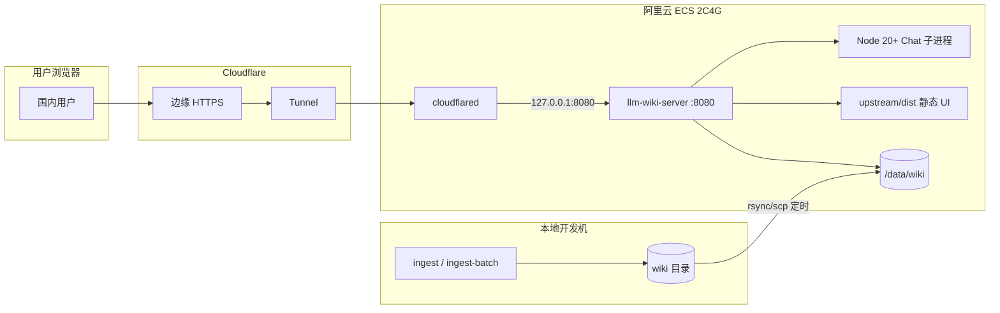

# 国内 ECS + Cloudflare Tunnel 部署方案

面向**国内用户**的第一阶段部署：Wiki 在本地 ingest，只读服务（搜索 + Chat）跑在**阿里云 ECS**，通过 **Cloudflare Tunnel（cloudflared）** 暴露 HTTPS，不开放公网 8080。

成熟后第二阶段：将同一套服务迁到**海外 VPS**，面向国际用户；Tunnel 与同步流程基本不变，主要换机器与 DNS。

---

## 1. 架构总览



| 组件 | 位置 | 说明 |
|------|------|------|
| Ingest | **仅本地** | `./scripts/llm-wiki ingest`；ECS 不跑入库 |
| Wiki 数据 | ECS `/data/wiki` | 只读挂载；定时 rsync |
| `llm-wiki-server` | ECS | Rust 二进制，监听 `127.0.0.1:8080` |
| Node.js | ECS | Chat 通过 `npx tsx overlay/cli/node/...` 调 LLM |
| 静态 UI | ECS `upstream/dist` | 完整 UI + `/lite/` 同源托管 |
| cloudflared | ECS | Tunnel 到 Cloudflare，**不**用 SSH 反向代理 |
| LLM / Embedding API | 公网 | 按 `server.local.json` 配置（如 DashScope） |

---

## 2. 实施前信息清单（请确认）

以下信息**不影响方案结构**，但会影响具体命令与域名策略。可先按默认值推进，缺项用占位符。

| # | 项目 | 示例 / 说明 | 是否必需 |
|---|------|-------------|----------|
| 1 | ECS 系统 | Ubuntu 22.04 / Alibaba Cloud Linux 3 | 推荐 Ubuntu 22.04 |
| 2 | ECS 地域 | 华东1（杭州）等 | 离用户近即可 |
| 3 | SSH 登录方式 | 密钥 + `root` 或 `deploy` 用户 | 必需 |
| 4 | 域名 | `wiki.example.com` | 必需（Tunnel 自定义域） |
| 5 | 域名 DNS | 已接入 Cloudflare（橙云或灰云均可，Tunnel 用 CNAME） | 必需 |
| 6 | ICP 备案 | 若用**国内直连**需备案；纯 Tunnel 子域有时可暂不备案 | 视访问方式 |
| 7 | Cloudflare 账号 | 免费版即可 | 必需 |
| 8 | 首期 Wiki 项目 | `ParentingBooks` / `CivilCareer` | 至少一个 |
| 9 | LLM 提供商 | DashScope / OpenAI 兼容等 | Chat 必需 |
| 10 | Embedding | 与 ingest 时一致（如 `text-embedding-v4`） | 搜索必需 |
| 11 | UI 形态 | 完整 HTTP UI / 仅 Lite `/lite/` | 建议先 Lite 或完整二选一 |
| 12 | API Token | 强随机字符串，构建与运行时一致 | 必需 |

**当前可默认的占位值**（你未提供时）：

- OS：Ubuntu 22.04
- Wiki 路径：`/data/wiki/ParentingBooks`（单项目）
- 端口：`8080` 仅本机
- Token：部署时生成一次，写入 `server.local.json` 与 `VITE_API_TOKEN`

---

## 3. 阶段一：国内 ECS 部署（逐步）

### 3.1 ECS 规格与安全组

- **规格**：2 vCPU / 4 GiB 足够搜索 + 轻量 Chat。
- **安全组入站**：
  - `22/tcp`：你的办公 IP（或堡垒机）
  - **不要**开放 `8080` 到 `0.0.0.0/0`
- **出站**：允许 HTTPS（443）访问 Cloudflare、LLM、Embedding API。

### 3.2 系统依赖

在 ECS 上执行（Ubuntu 22.04）：

```bash
sudo apt update && sudo apt install -y curl rsync build-essential pkg-config libssl-dev

# Node 20+（Chat 必需）
curl -fsSL https://deb.nodesource.com/setup_20.x | sudo -E bash -
sudo apt install -y nodejs

# Rust（若不在本机交叉编译，则在 ECS 上编译 server）
curl --proto '=https' --tlsv1.2 -sSf https://sh.rustup.rs | sh -s -- -y
source "$HOME/.cargo/env"
```

验证：

```bash
node -v    # v20+
rustc -V
```

### 3.3 目录规划

```bash
sudo mkdir -p /opt/llm-wiki /data/wiki
sudo chown -R "$USER:$USER" /opt/llm-wiki /data/wiki
```

| 路径 | 内容 |
|------|------|
| `/opt/llm-wiki/` | `llm-wiki-server` 二进制、`upstream/dist`、`upstream/src`（Chat）、`overlay/cli/node` |
| `/data/wiki/<ProjectName>/` | 同步后的 wiki（含 `.llm-wiki` 等） |
| `/etc/llm-wiki/` | `server.local.json`、`env`（权限 `600`，勿入 git） |

### 3.4 同步 Wiki（本地 → ECS）

在**本地**（ingest 完成后）：

```bash
# 示例：同步 ParentingBooks
rsync -avz --delete \
  ~/path/to/llm_wiki_projects/ParentingBooks/ \
  deploy@YOUR_ECS_IP:/data/wiki/ParentingBooks/
```

建议 crontab（本地，每日或 ingest 后手动）：

```cron
0 3 * * * rsync -avz --delete /path/to/ParentingBooks/ deploy@ECS:/data/wiki/ParentingBooks/
```

`--delete` 会删 ECS 上多余文件；首次同步前确认路径无误。

### 3.5 部署代码与构建

**方式 A（推荐）**：本地交叉编译 + 只上传产物，ECS 负担小。

```bash
# 本地仓库根目录
git submodule update --init --recursive

# 构建 server（release）
cargo build --release --manifest-path overlay/server/Cargo.toml

# 构建 UI（Token 与线上一致）
export VITE_API_TOKEN='你的强随机Token'
# 同源部署：VITE_API_BASE 留空
# build-web.sh 会把 overlay/static/lite/ 复制进 upstream/dist/lite/，无需单独同步 Lite 源目录
VITE_BACKEND=http VITE_API_TOKEN="$VITE_API_TOKEN" ./scripts/build-web.sh

ECS=/opt/llm-wiki
HOST=deploy@YOUR_ECS_IP

# 二进制（放在仓库根，与 overlay/ 并列）
rsync -avz overlay/server/target/release/llm-wiki-server \
  "${HOST}:${ECS}/"

# 静态 UI（含 /lite/）
rsync -avz upstream/dist/ "${HOST}:${ECS}/upstream/dist/"

# Chat 脚本与 tsconfig（排除 node_modules，在 ECS 上 npm install）
rsync -avz --exclude node_modules \
  overlay/cli/ "${HOST}:${ECS}/overlay/cli/"

# @/ alias 指向 upstream/src（Chat 必需，见 §3.5.1）
rsync -avz --exclude node_modules \
  upstream/src/ "${HOST}:${ECS}/upstream/src/"
```

**方式 B**：在 ECS 上 `git clone` 后完整构建（需 ECS 上安装 Rust + Node，2C4G 编译较慢）。

无论 A/B，ECS 上都必须安装 Chat 依赖：

```bash
cd /opt/llm-wiki/overlay/cli/node
npm ci    # 或 npm install；安装 tsx 等，供 npx tsx 使用
```

#### 3.5.1 Chat 运行时依赖说明

| 依赖 | 原因 |
|------|------|
| `overlay/cli/node/node_modules/` | `chat.rs` 通过 `npx tsx …/cmd-llm-stream.ts` 启动；需 **tsx** |
| `upstream/src/` | `cmd-llm-stream.ts` 的 `@/lib/llm-client` 等 import 由 **`overlay/cli/node/tsconfig.json` paths** 映射到 `upstream/src/*`，**不是** Vite 构建产物 |
| `LLM_WIKI_REPO` 环境变量 | 二进制从本机拷到 ECS 后，编译期 `CARGO_MANIFEST_DIR` 仍指向构建机路径；**必须**设 `LLM_WIKI_REPO=/opt/llm-wiki`，否则找不到 `overlay/cli/node/src/cmd-llm-stream.ts` |

本地验证 Chat 脚本（模块解析，非 LLM 连通性）：

```bash
cd overlay/cli/node
echo '{"messages":[{"role":"user","content":"ping"}]}' \
  | LLM_WIKI_REPO="$(cd ../.. && pwd)" \
    npx tsx src/cmd-llm-stream.ts --config ../../config/server.example.json
# 若出现 network/endpoint 相关 error 而非 "Cannot find module '@/…'"，说明 alias 解析正常
```

**Lite 静态页**：执行 `build-web.sh` 后 Lite 已在 `upstream/dist/lite/` 内；**不要**再单独 rsync `overlay/static/lite/`（除非你在 ECS 上跳过 build-web、手工维护 dist）。

### 3.6 服务端配置

复制并编辑（**勿提交 git**）：

```bash
sudo mkdir -p /etc/llm-wiki
sudo cp /opt/llm-wiki/overlay/config/server.example.json /etc/llm-wiki/server.local.json
sudo chmod 600 /etc/llm-wiki/server.local.json
sudo chown deploy:deploy /etc/llm-wiki/server.local.json
```

`/etc/llm-wiki/server.local.json` 要点：

```json
{
  "projects": [
    { "path": "/data/wiki/ParentingBooks" }
  ],
  "apiConfig": {
    "enabled": true,
    "allowUnauthenticated": false,
    "token": "与 VITE_API_TOKEN 相同"
  },
  "embeddingConfig": { "...": "与 ingest 一致" },
  "llmConfig": { "...": "Chat 用" }
}
```

环境变量（敏感项建议用 env，配置里 `${VAR}` 引用）：

```bash
# /etc/llm-wiki/env（chmod 600）
export LLM_WIKI_REPO=/opt/llm-wiki
export LLM_WIKI_CONFIG=/etc/llm-wiki/server.local.json
export LLM_WIKI_STATIC=/opt/llm-wiki/upstream/dist
export LLM_WIKI_BIND=127.0.0.1:8080
export LLM_WIKI_API_TOKEN='与 json 中 token 一致'
export DASHSCOPE_API_KEY='...'
export LLM_API_KEY='...'
```

### 3.6.1 公网模式:多用户认证

公网部署时启用账号系统(注册/登录/历史/用量限额),让落地页取代重前端 UI 作为入口:

```bash
sudo mkdir -p /var/lib/llm-wiki
sudo chown deploy: /var/lib/llm-wiki
sudo chmod 700 /var/lib/llm-wiki
```

在 `/etc/llm-wiki/env` 追加:

```bash
export LLM_WIKI_AUTH_DB=/var/lib/llm-wiki/auth.db
export LLM_WIKI_REQUIRE_LOGIN=true
export LLM_WIKI_DAILY_CHAT_LIMIT=50
export LLM_WIKI_ADMIN_EMAIL=you@example.com   # 该邮箱注册时自动 admin
export LLM_WIKI_SESSION_TTL_DAYS=30
export LLM_WIKI_PUBLIC_LANDING_DIR=/opt/llm-wiki/overlay/static
```

`overlay/static/` 已随代码同步到 ECS 的 `/opt/llm-wiki/overlay/static/`(rsync 时已包含)。

`systemctl restart llm-wiki-server` 后,访问 `https://your-domain/`:

| 路径 | 显示 |
|------|------|
| `/` | 落地页 |
| `/login` `/register` | 登录/注册(同一页,tab 切换) |
| `/reset-password` | 重置密码(token 暂时打到 server stderr,通过 `journalctl -u llm-wiki-server` 取) |
| `/lite/` | 问答页(需登录) |
| `/api/v1/*` | 仍接受 cookie 或 Bearer(CLI 不变) |

**备份:** 将 `/var/lib/llm-wiki/auth.db` 加入备份清单。生产建议用 `sqlite3 auth.db ".backup /backup/auth.db"`(WAL 模式下直接 `cp` 可能拿到部分写入)。

### 3.7 systemd：llm-wiki-server

`/etc/systemd/system/llm-wiki-server.service`：

```ini
[Unit]
Description=llm-wiki HTTP server
After=network-online.target
Wants=network-online.target

[Service]
Type=simple
User=deploy
Group=deploy
WorkingDirectory=/opt/llm-wiki
EnvironmentFile=/etc/llm-wiki/env
ExecStart=/opt/llm-wiki/llm-wiki-server --bind 127.0.0.1:8080
Restart=on-failure
RestartSec=5

[Install]
WantedBy=multi-user.target
```

```bash
sudo systemctl daemon-reload
sudo systemctl enable --now llm-wiki-server
curl -sS -H "Authorization: Bearer $LLM_WIKI_API_TOKEN" \
  http://127.0.0.1:8080/api/v1/projects | head
```

### 3.8 Cloudflare Tunnel

1. 登录 [Cloudflare Zero Trust](https://one.dash.cloudflare.com/) → **Networks → Tunnels** → Create tunnel。
2. 选择 **Cloudflared**，复制安装命令，在 ECS 执行（会安装 `cloudflared` 并注册）。
3. **Public Hostname**：
   - Subdomain：`wiki`（或 `kb`）
   - Domain：你的域
   - Service：`http://127.0.0.1:8080`
4. DNS 会自动添加 CNAME 到 `<tunnel-id>.cfargotunnel.com`。

**systemd（若安装器未创建）** 示例 `/etc/systemd/system/cloudflared.service` 使用官方提供的 token 或 `config.yml`。

验证（本机 ECS）：

```bash
curl -sS -o /dev/null -w "%{http_code}" http://127.0.0.1:8080/
# 200
```

外网：

```bash
curl -sS -o /dev/null -w "%{http_code}" https://wiki.example.com/
```

### 3.9 冒烟测试

| 检查项 | 命令 / 操作 |
|--------|-------------|
| 项目列表 | `GET /api/v1/projects` 带 Bearer |
| 首页 UI | 浏览器打开 `https://wiki.example.com/` |
| Lite | `https://wiki.example.com/lite/` |
| 搜索 | UI 或 `POST /api/v1/search` |
| Chat 流式 | Lite 或 UI 发一条问题，观察 SSE |
| Token 不一致 | 故意错 token → 401 |

Chat 失败时常见原因：未设 `LLM_WIKI_REPO`、ECS 未装 Node、`overlay/cli/node` 未 `npm install`、缺少 `upstream/src/`、LLM 密钥或 endpoint 错误。

### 3.10 国内访问与性能说明

- **Tunnel 路径**：用户 → Cloudflare 边缘 → Tunnel → 国内 ECS。比「备案域名 + Nginx 直连 ECS」多一跳，通常可接受（个人/家庭知识库）。
- 若国内用户反馈慢，**可选增强**（与 Tunnel 并存或替代）：
  - 已备案域名 → 阿里云 SLB/Nginx → `127.0.0.1:8080`（8080 仍不对公网）
  - UI 仍建议与 API **同源**，避免 CORS 与双域 Token 问题。
- **LLM 延迟**仍取决于 API 地域（国内 ECS + 国内 DashScope 通常较好）。

---

## 4. 日常运维

### 4.1 更新 Wiki

1. 本地 ingest  
2. `rsync` 到 ECS  
3. **无需重启** server（只读读盘；若遇缓存问题再 `systemctl restart llm-wiki-server`）

### 4.2 更新程序

1. 本地构建新 `llm-wiki-server` + `upstream/dist`  
2. rsync 到 `/opt/llm-wiki/`  
3. `sudo systemctl restart llm-wiki-server`

### 4.3 日志

```bash
journalctl -u llm-wiki-server -f
journalctl -u cloudflared -f
```

### 4.4 备份

- `/etc/llm-wiki/server.local.json`（加密存储）
- `/data/wiki/`（rsync 回本地即备份）

---

## 5. 阶段二：迁到海外 VPS

目标：服务靠近国际用户与 OpenAI 等 API；**ingest 仍建议本地**，再 rsync wiki。

### 5.1 迁移步骤（ checklist ）

| 步骤 | 操作 |
|------|------|
| 1 | 新购 VPS（如新加坡/美西），同样 2C4G 起 |
| 2 | 重复 §3.2–3.7（依赖、目录、二进制、配置、systemd） |
| 3 | `rsync` wiki 到新机器 `/data/wiki/` |
| 4 | 新 ECS 上 `curl` 本机 8080 冒烟 |
| 5 | Cloudflare Tunnel：**新建 tunnel 或改 connector** 指向新机器 |
| 6 | 更新 Public Hostname 或切换 DNS CNAME |
| 7 | 旧 ECS 停止 `cloudflared` 与 `llm-wiki-server` |
| 8 | 观察 24h 日志与 Chat |

### 5.2 国际用户可选增强

- **Cloudflare Pages** 仅托管静态 UI（构建时 `VITE_API_BASE=https://api.example.com`），API 仍在 VPS Tunnel 子域——适合 UI 全球 CDN、API 单点。
- 国内用户迁走后若仍要服务：保留国内 ECS + 国内域名直连，或接受 Tunnel 跨境延迟。

### 5.3 配置差异摘要

| 项目 | 国内阶段 | 海外阶段 |
|------|----------|----------|
| ECS 地域 | 阿里云国内 | 海外 VPS |
| LLM | 国内兼容 API 优先 | OpenAI / 国际 API |
| UI 分发 | 同源 ECS | 同源或 Pages + API 子域 |
| Tunnel | 必需（隐藏 IP、HTTPS） | 同样推荐 |
| 备案 | 直连时需要 | 通常不需要 |

---

## 6. 安全清单

- [ ] `LLM_WIKI_REPO=/opt/llm-wiki`（拷出二进制部署时**必需**）  
- [ ] `8080` 仅 `127.0.0.1`（`--bind` 或 `LLM_WIKI_BIND`），安全组不开放  
- [ ] `LLM_WIKI_API_TOKEN` 强随机；`allowUnauthenticated: false`  
- [ ] `server.local.json` 权限 `600`，不进 git  
- [ ] SSH 密钥登录，禁用密码（可选）  
- [ ] Cloudflare：**Access** 策略（可选，家庭可 IP 或邮箱 OTP）  
- [ ] 定期 `rsync` 与系统 `unattended-upgrades`

---

## 7. 故障排查

| 现象 | 可能原因 | 处理 |
|------|----------|------|
| 外网 502 | cloudflared 未运行或指错端口 | `systemctl status cloudflared` |
| UI 空白 / 404 | `LLM_WIKI_STATIC` 路径错 | 确认 `upstream/dist` 存在 |
| API 401 | Token 与构建 UI 不一致 | 重建 UI 并强刷缓存 |
| Chat 无响应 | 无 Node / 缺 upstream/src / 未设 LLM_WIKI_REPO | 见 §3.5.1；`journalctl -u llm-wiki-server` |
| 搜索无结果 | wiki 未同步或 embedding 配置与 ingest 不一致 | 检查 `/data/wiki` 与 config |
| 国内很慢 | Tunnel 绕路 | 考虑备案 + Nginx 直连 |

更多开发期 FAQ 见 [开发与测试.md](./开发与测试.md)。

---

## 8. 相关文档

- [部署指引.md](./部署指引.md) — 部署选型与检查清单  
- [代码结构总览.md](./代码结构总览.md) — 架构与 Chat 子进程  
- [overlay/config/README.md](../overlay/config/README.md) — 配置项  
- [overlay/web/README.md](../overlay/web/README.md) — `VITE_API_TOKEN` / 构建  
- [docker/README.md](../docker/README.md) — Docker 方案（当前镜像**无 Node**，Chat 需宿主机 Node 或改镜像）

---

## 9. 下一步（你提供信息后可细化）

回复以下项即可生成**填好占位符的一键脚本草案**（仍建议在 ECS 上手改密钥）：

1. ECS 公网 IP 与 SSH 用户  
2. 域名（是否已在 Cloudflare）  
3. 首期项目名与本地 wiki 绝对路径  
4. LLM / Embedding 提供商（是否 DashScope）  
5. 先用完整 UI 还是仅 Lite  
